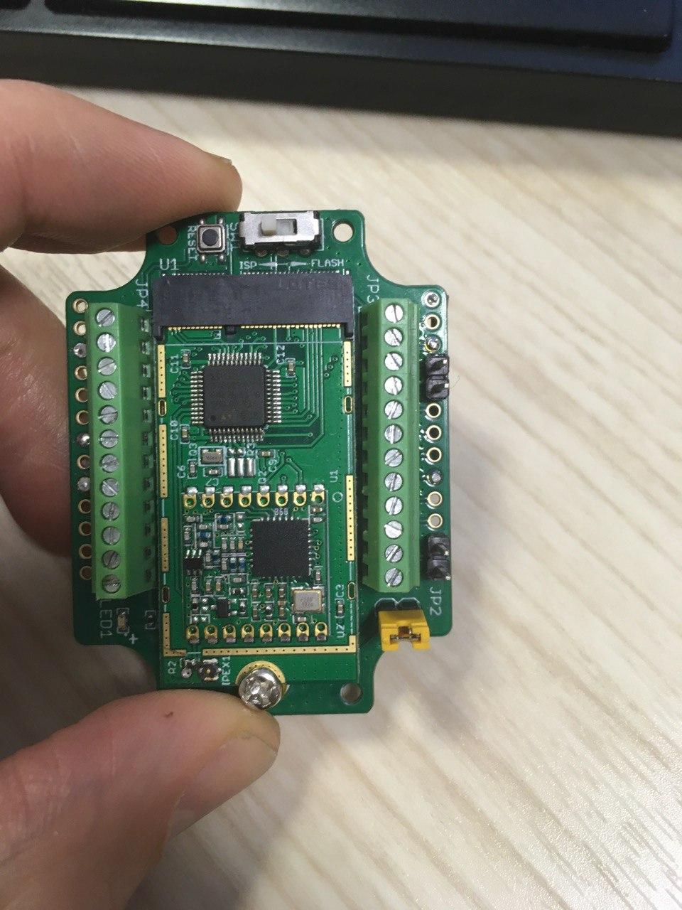

# Подготовка устройства SOFIOT ML-1.3
1. Достать устройство из коробки.
2. Раскрутить устройство, винты положить в коробку (не потерять винты).
3. Снять крышку с устройства.
4. При необходимости заправить уплотнительную резинку обратно в крышку, если она вылезла. Не использовать клей для фиксации прокладки.
Можно быстросохнущий герметик.
5. Перейти к **Пайке** и **Присоединению разьема для антенны к крышке**

## Пайка

### Подготовка к пайке:
1. Взять 2 резистора (желательно 560кОм, в крайнем случае допускается 1МОм).
2. Отрезать 2 куска термоусадки диаметром 2мм по 20мм длинной для резисторов.
3. Одеть термоусадку на резисторы. Один резистор должен располагаться по середине куска термоусадки - дальше называем его R1, другой смещен к краю термоусадки - R2. Усадить термоусадку феном.
4. Отрезать 2 куска штыревых разъемов по 2 пина.

### Пайка компонентов.
5. Вставить и припаять первую пару штыревых разъемов на VDD и GND и вторую на PA3 и PA2

6. Вставить один вывод резистора R1 в VDD отверстие снизу, а второй вывод на PB4. Вставить один вывод резистора R2 в то же VDD отверстие а второй вывод на PA1. 
Припаять вставленные резисторы. Обрезать торчащие выводы резисторов.

## Присоединение разьема для антенны к крышке
1. Развинтить гермоввод сверху крышки.
2. Просверлить отверстие для разьема антенны в крышке (6.5мм) на короткой стороне. Положение отверстия 24мм от края и 10мм от верхней поверхности крышки.
3. Вставить разьем для антенны изнутри и затянуть гайку снаружи без стопорного кольца.
4. Замазать вставленный разьем изнутри герметиком.

## Упаковать устройство для транспортировки.
Упаковать устройство с незакрученной крышкой как в примере, который мы прислали.
